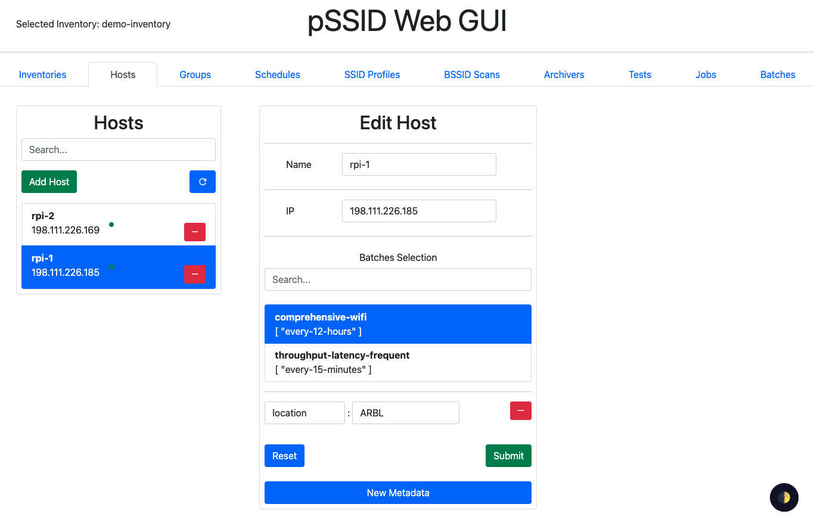

# pSSID-GUI

A web app for creating Ansible inventories usable by [ansible-playbook-pssid-daemon](https://github.com/UMNET-perfSONAR/ansible-playbook-pssid-daemon) for provisioning Raspberry Pi's running [pSSID](https://github.com/UMNET-perfSONAR/pSSID).



## Building Locally

Install Docker (along with `docker-compose`/`docker compose`). Run

```
PORT=8080 INV_DIR=./inventories docker compose up --build
```

to build it and run in the foreground. Alternatively run

```
PORT=8080 INV_DIR=./inventories docker compose up --build -d
```

to build and run in the background.

## Provisioning

Use [ansible-playbook-pssid-gui](https://github.com/UMNET-perfSONAR/ansible-playbook-pssid-gui) to provision.

## Documentation

[./docs](./docs)
