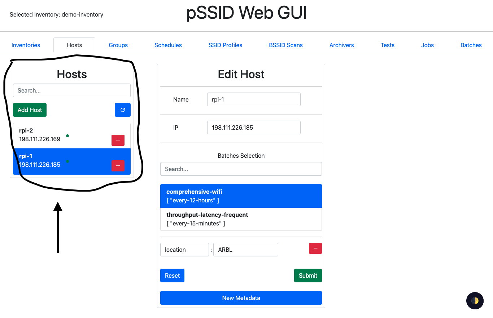
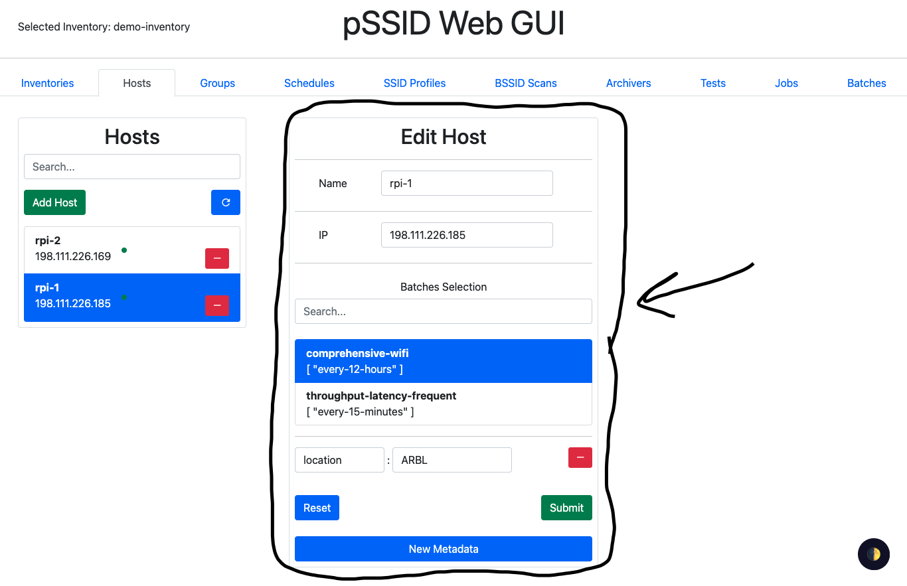

# pSSID-GUI Backend

`src/App.vue` is the homepage/overall page:

`src/components/vueEditor.vue` is the box on the left to view preexisting entries:

`src/components/nodeVue.vue` is the form to modify existing and add new entries:

`src/assets/*.json` are specifications that describe the available options in the `src/components/nodeVue.vue` form. These schemas (arrays of `slot`s I guess) are mostly self-descriptive. The type of a slot appears to be determined by its `componentname`. Each `componentname` corresponds with a handler in `src/components/inputTypes`. By going through each one, the types corresponding to each appear to be (at the level of the HTTP request):

| `componentname` | Type |
| - | - |
| `channelPicker` | `number[]` |
| `checkboxInput` | `boolean` |
| `cronInput` | `...{ minute: string, hour: string, day: string, year: string }` |
| `customInput` | listed under `props.type`, default appears to be `string` |
| `jsonEditor` | arbitrary JSON, it appears |
| `metadataInput` | similar to `jsonEditor` |
| `nodePicker` | `string` if `props.single == true`, otherwise `string[]`, the strings correspond with the names of the mentioned node |
